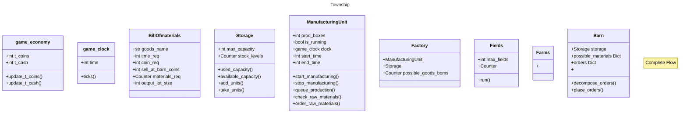

```mermaid
---
title: Township
---

classDiagram
  note "Complete Flow"

  class game_economy{
    +int t_coins
    +int t_cash
    +update_t_coins()
    +update_t_cash()
  }
  class game_clock{
    +int time
    +ticks()
  }
  class BillOfmaterials{
    +str goods_name
    +int time_req
    +int coin_req
    +int sell_at_barn_coins
    +Counter materials_req
    +int output_lot_size
  }
  class Storage{
    +int max_capacity
    +Counter stock_levels
    +used_capacity()
    +available_capacity()
    +add_units()
    +take_units()
  }
  class ManufacturingUnit{
    +int prod_boxes
    +bool is_running
    +game_clock clock
    +int start_time
    +int end_time
    +start_manufacturing()
    +stop_manufacturing()
    +queue_production()
    +check_raw_materials()
    +order_raw_materials()
  }
  class Factory{
    +ManufacturingUnit
    +Storage
    +Counter possible_goods_boms
  }
  class Fields{
    +int max_fields
    +Counter
    +run()
  }
  class Farms{
    +
  }
  class Barn{
    +Storage storage
    +possible_materials Dict
    +orders Dict
    +decompose_orders()
    +place_orders()
    +
  }
```
